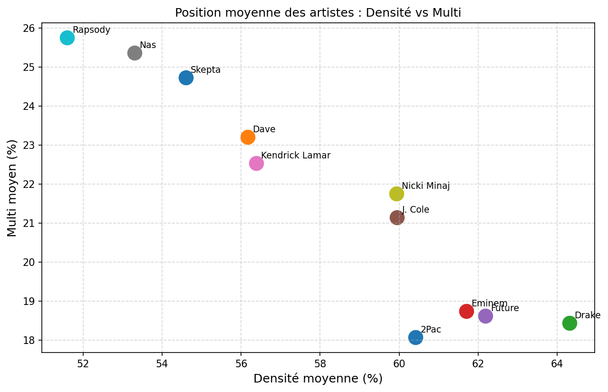
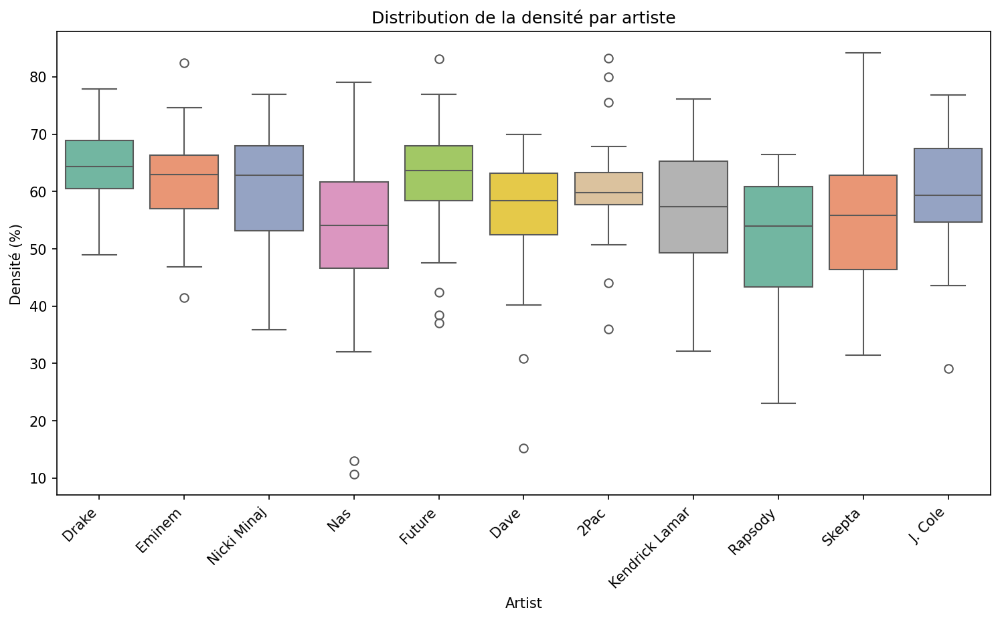
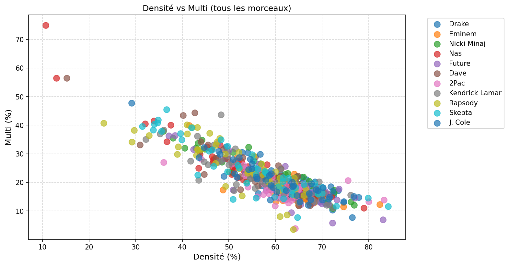
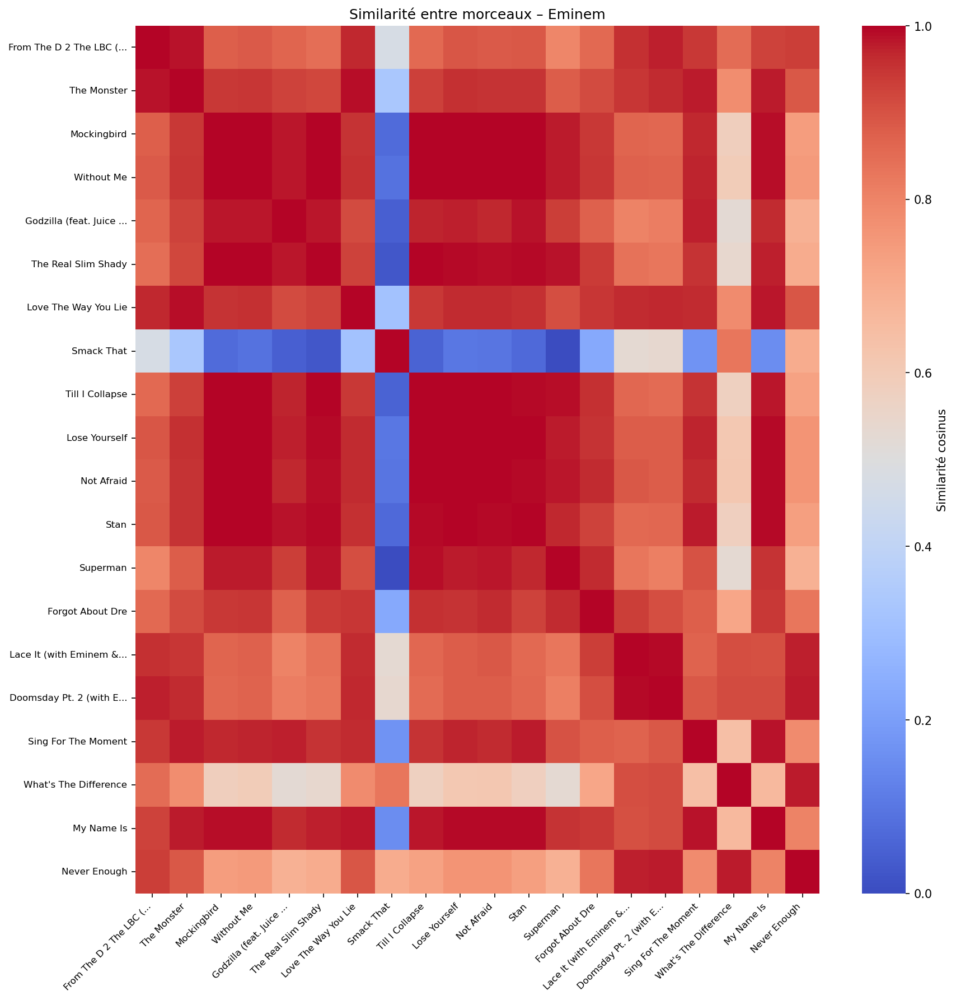

# RhymeMapper

**RhymeMapper** is a Python tool for analyzing rhyme schemes in rap lyrics using phonetic data.  
It splits words into syllables, extracts phonetic features (nucleus and coda), and color‑codes rhyming syllables in the terminal output. It also computes statistical metrics (density, diversity, etc.) and generates comparative graphs.

## Features

- Phonetic transcription using `g2p_en`
- Syllable splitting with `syllabify` (fallback heuristic for unknown words)
- Rhyme signature based on vowel nucleus and consonant coda (slant rhyme support)
- Terminal output with ANSI colors for rhyming syllables
- Adjustable minimum occurrence threshold for rhyme groups
- Batch analysis from CSV files (`scripts/generate_stats.py`)
- Statistical visualisations (boxplots, scatter plots, similarity heatmaps) via `analysis/`
- `Makefile` to automate common tasks

## Usage

### Quick demo:

- make demo

### Generate statistics from a lyrics CSV 
IT TAKES A BIT OF TIME !!!! 
- make stats

* you can use this one : https://www.kaggle.com/datasets/ceebloop/rap-lyrics-for-nlp?resource=download

### Produce all graphs (scatter, boxplot, heatmaps)
- make plots

* here is some plots: 

### Run unit tests:
make test 

### Project structure:
RhymeMapper/
├── src/               # core modules (models, phonetics, engine, visual, main)
├── scripts/           # generate_stats.py
├── analysis/          # plotting scripts (config, data_loader, plots, run_all_plots)
├── dataset/           # input CSV files (lyrics_raw.csv, artists_sample.csv)
├── data/              # generated stats.csv and figures
├── tests/             # unit tests
├── Makefile           # automation
├── requirements.txt   # dependencies
└── README.md

### Dependencies

    Python 3.7+

    g2p_en, syllabify, pandas, matplotlib, seaborn, numpy, scikit-learn

### 
